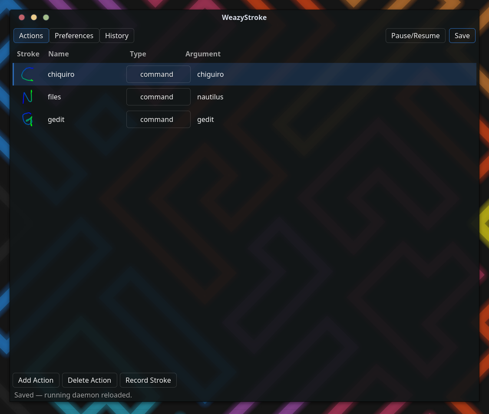

# WeazyStroke

Gesture recognition for **Wayland**. Draw a stroke with your **mouse, pen/tablet,
stylus, or fingers** and WeazyStroke runs an action — launch a command, send a
key combo, type text, click a button, scroll, and more.

A desktop-environment-agnostic GTK4 + libadwaita app, built on the recognition
core of the classic [easystroke](https://github.com/thjaeger/easystroke) and
rebuilt for Wayland. Works on any Wayland compositor (the on-screen trail uses
`gtk4-layer-shell`, supported everywhere except GNOME).



## Features

- **Every pointing device** — one gesture engine across **mouse**, **pen/tablet**,
  **stylus**, and **touch**.
- **Pen pressure → line width** — the live trail thickens as you press harder,
  driven by real tablet pressure.
- **Two-finger touch gestures** — hold a finger inside a screen-edge band to *arm*,
  draw with a second finger; an expanding ring marks the armed point and the trail
  responds to finger **contact size**.
- **Flexible triggers** — a mouse button (with optional modifiers), the pen tip,
  the side button, or a "tip + side button" chord that keeps the side button free
  for other uses; plus a configurable touch edge.
- **Live stroke overlay** — a click-through trail that follows your stroke: a
  direction **gradient** with customizable start/end colors, **Plain / Glow /
  Sparkle** styles, adjustable width, a hairline onset taper, and an animated
  completion retract.
- **Typed actions** — per gesture: run a **command**, send a **key** combo, type
  **text**, click a **button**, **scroll**, or **ignore**.
- **Sturdy recognition** — record a gesture several times for multi-example
  matching; tune the match threshold.
- **GTK4 + libadwaita GUI** — an Actions table with per-gesture stroke thumbnails,
  paginated preferences, a glass aesthetic, a History tab, and an in-window stroke
  recorder.
- **System tray** — enable/disable, open preferences, quit (StatusNotifierItem).
- **Autostart & live reload** — one toggle installs a systemd user service; saving
  in the GUI applies instantly to the running daemon, no restart.

## Install

**Arch:**

```sh
cd packaging && makepkg -si
```

**From source:**

```sh
cmake -S . -B build -G Ninja -DCMAKE_BUILD_TYPE=Release -DENABLE_ASAN=OFF
cmake --build build
sudo cmake --install build
```

Dependencies: `libinput`, `libevdev`, `libxkbcommon`, `gtk4`, `gtk4-layer-shell`,
`libadwaita`, `glib2`, `systemd` (libudev); a C11/C++17 compiler, CMake ≥ 3.18.
(Drop the `-DCMAKE_BUILD_TYPE`/`-DENABLE_ASAN` flags for a sanitized dev build;
run the tests with `ctest --test-dir build`.)

Installs four binaries: `eswl-daemon` (engine), `eswl-overlay` (trail renderer),
`eswl-config` (GUI), `eswl-tray` (tray).

## Usage

1. Open **WeazyStroke** (`eswl-config`); enable *Start on login* to autostart it.
2. **Record Stroke** → draw it → name it → choose a Type + Argument (command, key,
   text, button, scroll) → **Save**.
3. Draw the gesture with your trigger:
   - **Mouse** — hold the configured button (+ optional modifiers) and draw.
   - **Pen** — tip, side button, or the "tip + side button" chord.
   - **Touch** — hold a finger in the chosen edge band, draw with a second finger.

Triggers, the trail, colors, pressure, and touch are all tunable in
**Preferences**; changes apply live.

## Permissions

The engine reads `/dev/input/event*` and read-writes `/dev/uinput`. The Arch
package installs the udev rule; from source, install it and join the `input`
group:

```sh
sudo cp packaging/99-easystroke-wayland.rules /etc/udev/rules.d/
sudo udevadm control --reload-rules && sudo udevadm trigger
sudo usermod -aG input "$USER"        # then re-login
```

## License

ISC, inheriting easystroke's license. Recognition core from
[easystroke](https://github.com/thjaeger/easystroke) by Thomas Jaeger.
